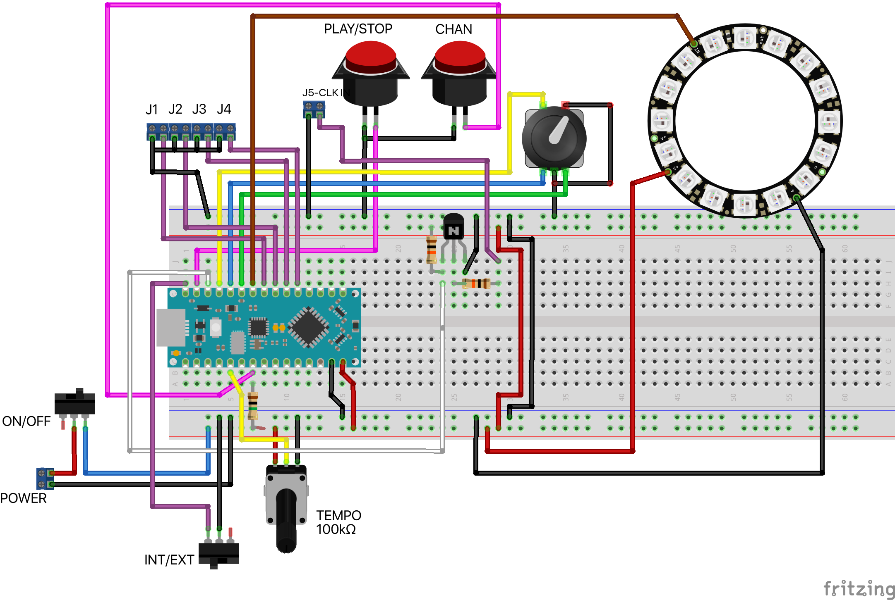

# **Neno Euclid**
## _Arduino-based Euclid Rhythm Sequencer_

## **Features**
- 4 Channels with 4 gate outputs
- Each channel has 16 steps pattern
- NeoPixels ring is used as main UI elelemt
- Rotary encoder to control various parameters of the pattern
    - Pattern length 1-16 notes
    - Number of "ON" slots in the pattern
    - Pattern start offset
- Each channel can be independently edited, and the 4 channels combination is a "patch"
- You can save and later load up to 16 patches in EEPROM (kept even with power off)
- The unit has internal clock with controlled rythm, but can also be switched to use external eurorack clock signal

### **To build the software**
The following library is needed:
Adafruit_NeoPixel for the NeoPixels ring display [Available on their Github page](https://github.com/adafruit/Adafruit_NeoPixel)

### **Hardware**
This is the circuit diagram (breadboard version). The Fritzing file is included in the Hardware folder.

### **User Manual**

OK, not a full manual, but a start on how to use the NanoEuclid module.

Clicking the Channel button switches the current edited channel, the led ring will show the pattern length using the channel color (TBD).

Turning the rotary encoder will shorten or lengthen the pattern length.

Click the rotary encoder once to edit the number of active beats, the number of active beats will be indicated by the bright leds scattered around the pattern. Turning the rotary encoder will increase or decrease the number of active beats.

Click the rotary encoder once more to edit the pattern start position, turning the rotary encoder will shift the starting point forward or backward in the pattern.

Click the Play/Stop button to start playing the sequence. If the switch is in internal mode, the internal clock will be used. If the switch is in EXT mode, the external clock will be used to advance the sequence to the next step in the pattern.

In INT mode, the clock rate is controlled with the Rate potentiometer.

If you like the patch you created (a patch is the combination of patterns in all four channels), you can store it to EEPROM. There are 16 memory slots to save patches to.

To store or load a patch, you need to switch the module to MEMORY mode by long pressing the rotary encoder. Once in MEMORY mode, the led ring will show taken positions in GREEN, free positions in RED, and the current position in pink.

Press the CHN/Store button to store the current patch to the selected memory position.

Press the PLAY/Load button to load the content of memory in the current position to the active patch area.

